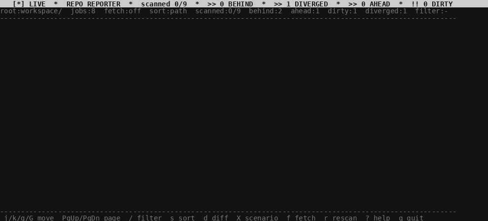

# repo_report



`repo-report` は単一ファイルの Bash CLI です。ディレクトリツリーを走査し、ネストされたすべての git リポジトリ（`.git` ディレクトリおよび `.git` gitfile ポインタ — Google の `repo` ツールやサブモジュールで使用される形式）を検出してそのステータスを表示します。2 つのモードがあります：

- **インタラクティブ TUI**（実端末上でのデフォルト）— アニメーション付きの `🔴 LIVE · REPO REPORTER` ニュースティッカーが上部をスクロールしながら、ワーカーがスクロール・フィルタ・ソート可能なリストに結果を流し込みます。`?` キーで全キーバインドを確認できます。
- **非インタラクティブ**（パイプ時、または `--format` / `-n` 指定時）— `table` / `tsv` / `json` 形式のレポートを並列出力します。パイプライン、CI、および `/repo-report` Claude Code スキルに適しています。

通常のツール（`gita`、`mr`、`ghq`、Google `repo`）はリポジトリの事前登録が必要だったり、`.repo` ワークスペース全体で「すべて最新か？」を確認するためのコンパクトな機械可読レポートを出力できなかったりするため、このツールを作成しました。

## インストール不要で今すぐ使う

クローン直後からスクリプトをそのまま実行できます — インストール不要：

```sh
git clone https://github.com/nigoh/repo_report.git
cd repo_report
./bin/repo-report /path/to/workspace
```

## インストール（任意 — `repo-report` を PATH に追加する場合）

```sh
# Makefile 経由（デフォルトは /usr/local/bin）
make install
# カスタムプレフィックスを指定する場合
make install PREFIX=~/.local

# 手動でコピー
install -m0755 bin/repo-report /usr/local/bin/repo-report
# またはシンボリックリンク
ln -s "$PWD/bin/repo-report" ~/.local/bin/repo-report
```

アンインストール：`make uninstall`

依存関係：`bash`（>=4）、`git`、`find`、`xargs`、`awk`、`mkfifo`。  
`column` は任意（`--format table` でのテーブル整形に使用）。

### Ratatui TUI 版（`repo-report-tui`）のビルドとインストール

Rust 製の別実装です。`cargo` が必要です（Rust 1.60+）：

```sh
# ビルド
make build-tui               # → target/release/repo-report-tui

# インストール（デフォルトは /usr/local/bin）
make install-tui
make install-tui PREFIX=~/.local
```

## インタラクティブモード

引数なし（またはパス指定）で実端末上で実行します：

```sh
repo-report /path/to/workspace
```

レイアウト：

```
╭──────────────────────────────────────────────────────────────────╮
│ 🔴 LIVE · REPO REPORTER · scanned 42/120 · ⚡ 3 BEHIND · ⚠ 1 DIRTY │  ← スクロールするティッカー
├──────────────────────────────────────────────────────────────────┤
│ root:.  jobs:8  fetch:off  sort:path  scanned:42/120  behind:3   │  ← ステータスバー
├▓▓▓▓▓▓▓▓▓▓▓▓▓▓▓▓▓▓▓▓▓▓▓▓▓▓────────────────────────────────────┤  ← スキャン進捗バー
│ > workspace/proj-a        main  0a1b2c3  up-to-date  clean +0/-0 │  ← 結果
│   workspace/proj-b        main  3d4e5f6  behind      clean +0/-1 │
│   workspace/proj-c        main  7g8h9i0  up-to-date  dirty  s:2  │  ← s:N = stash 数
│   …                                                              │
├──────────────────────────────────────────────────────────────────┤
│ j/k/g/G move  PgUp/PgDn page  / filter  s sort  ? help  q quit   │  ← ヘルプバー
╰──────────────────────────────────────────────────────────────────╯
```

ティッカーは**データ駆動**です — スキャン実行中に新たな `behind` / `ahead` / `diverged` / `dirty` リポジトリが検出されるたびに `⚡` または `⚠` アイテムがニュース速報ストリップに追加されます。3 行目はスキャン中に**プログレスバー**を表示します。

**キー操作**

| キー              | 動作                                                        |
| ----------------- | ----------------------------------------------------------- |
| `j` / ↓           | カーソルを下に移動                                          |
| `k` / ↑           | カーソルを上に移動                                          |
| `g` / `G`         | リストの先頭 / 末尾にジャンプ                               |
| `PgDn` / `PgUp`   | 1 ページ下 / 上にスクロール                                 |
| `/`               | ライブフィルタ — 入力しながら即時絞り込み、Enter で確定、Esc でキャンセル |
| `Esc`             | アクティブなフィルタをクリア                                |
| `Enter`           | 選択リポジトリの詳細ペインを開く                            |
| `s`               | ソートモードをサイクル: `path` → `status` → `date` → `branch` → `ahead-desc` → `behind-desc` |
| `f`               | `--fetch` フラグを切り替えて再スキャン                      |
| `F`               | `repo sync` を実行（AOSP 専用）                             |
| `r`               | 再スキャン（`find` とワーカーを再実行）                     |
| `d`               | 選択リポジトリの差分オーバーレイ（`git diff` + staged）     |
| `T`               | `repo status` オーバーレイ（AOSP 専用）                     |
| `b`               | `repo branches` オーバーレイ（AOSP 専用）                   |
| `o`               | `repo overview` オーバーレイ（AOSP 専用）                   |
| `m`               | マニフェスト XML オーバーレイ（AOSP 専用）                  |
| `n`               | `repo sync -n` — フェッチのみ・ローカル更新なし（AOSP 専用）|
| `B`               | `repo start <branch> --all` — トピックブランチ作成（AOSP 専用）|
| `A`               | `repo abandon <branch>` — トピックブランチ削除・確認あり（AOSP 専用）|
| `:`               | `repo forall -c <cmd>` — 全プロジェクトにコマンド実行（AOSP 専用・破壊的コマンドはブロック）|
| `e`               | 現在のビューをファイルにエクスポート                        |
| `c`               | カラムヘッダ行をトグル                                      |
| `?`               | 全キーバインドのヘルプオーバーレイを表示                    |
| `q` / Ctrl-C      | 終了（端末を復元）                                          |

**カラーコード**

| カラー       | 意味          |
| ------------ | ------------- |
| 緑           | 最新          |
| 黄           | behind（遅れ）|
| シアン       | ahead（進み） |
| 赤           | diverged      |
| グレー       | upstream なし |
| 黄色 `s:N`   | stash エントリあり |

**AOSP / Google `repo` ツール ワークスペース**

スキャンルートに `.repo/` ディレクトリが存在する場合、`repo-report` は自動的に AOSP ワークスペースとして検出し、追加キーを有効化します：

| キー | コマンド | 補足 |
| ---- | -------- | ---- |
| `F` | `repo sync -c -j{N} --no-tags` | 推奨オプション付きフル同期 |
| `n` | `repo sync -n` | フェッチのみ — 安全、ローカル更新なし |
| `T` | `repo status` | 全プロジェクトの状態 |
| `b` | `repo branches` | 全プロジェクトのブランチ一覧 |
| `o` | `repo overview` | 最近のコミットサマリー |
| `m` | マニフェスト XML | `.repo/manifest.xml` の内容 |
| `D` | `repo download <project> <change>` | Gerrit レビューパッチをローカルに取得 |
| `M` | `make -j{N}` | ビルド実行 |
| `C` | `make clean` | 中間ファイルを削除（確認あり） |
| `B` | `repo start <branch> --all` | 全プロジェクトでトピックブランチ作成 |
| `A` | `repo abandon <branch>` | トピックブランチ削除（確認あり） |
| `:` | `repo forall -c <cmd>` | 全プロジェクトに任意コマンド実行；`reset --hard`・`clean -f`・`rm -rf` はブロック |

現在のマニフェストブランチはステータスバーに `[AOSP] repo:<branch>` として表示されます。  
コマンド実行中はティッカーにスピナーとコマンド名が表示されます。  
非 AOSP ワークスペースではこれらのキーは無効です。

---

## AOSP 運用ガイドライン

> Android / AOSP 開発チーム向け標準運用手順。  
> `repo-report-tui`（Ratatui 版）のキー操作で直接実行できます。

### 推奨デイリーワークフロー

```
1. T キー  → repo status      現在の変更状態を確認
2. F キー  → repo sync -c -j8 --no-tags   最新に同期（推奨オプション）
3. M キー  → make -j8         ビルド
```

ビルドエラーが発生した場合：

```
4. C キー  → make clean       中間ファイルを削除（確認ダイアログあり）
   → 再度 M キーでビルド
```

完全リセットが必要な場合は、ターミナルで `make clobber` を手動実行してください。

### `repo sync` 推奨オプション

| オプション | 効果 |
|-----------|------|
| `-c` | 現在のブランチのみ取得（不要なブランチをスキップ） |
| `-j8` | 並列ダウンロード数（環境に応じて調整、`-j` フラグで変更可） |
| `--no-tags` | タグを取得しないことで高速化 |

`F` キーはこれらのオプションをすべて適用します。  
`n` キーは `repo sync -n`（フェッチのみ・ローカル更新なし）を実行します — **安全で副作用なし**。

### `repo download`（Gerrit パッチ取得）

`D` キーを押すと入力プロンプトが表示されます：

```
入力: platform/frameworks/base 12345
実行: repo download platform/frameworks/base 12345
```

`repo sync` とは異なり、まだマージされていない Gerrit レビュー中のパッチをローカルで検証できます。

| コマンド | 対象 | 主な用途 |
|---------|------|---------|
| `F`（repo sync） | マージ済みのリモートブランチ | 日常的な最新コード取得 |
| `D`（repo download） | Gerrit 上のレビュー中パッチ | 他者のパッチを手元で検証 |

### ビルド操作の使い分け（`make`）

| キー | コマンド | 削除対象 | 使用タイミング |
|-----|---------|---------|--------------|
| `M` | `make -j{N}` | （削除なし） | 通常のビルド（まずこれを試す） |
| `C` | `make clean` | 中間ファイル | ビルドエラーが解消しない場合 |
| — | `make clobber` ※手動 | `out/` 全体 | 完全リセットが必要な場合 |

> **方針：** `make clean` は時間コストが高いため、原則として clean なしでビルドを試みてください。  
> エラーが発生した場合や挙動が不安定な場合のみ `C` キーで clean を実施します。

**`make clean` が必要なケース：**
- ヘッダファイルや共有ライブラリに大きな変更があった場合
- ビルドエラーが clean なしで解消しない場合
- 長期間 sync していなかった場合

### 安全機能

`repo forall -c`（`:` キー）では以下のパターンを含むコマンドはブロックされます：

```
reset --hard  /  clean -f  /  clean -fd  /  rm -rf  /  rm -fr
push --force  /  push -f  /  format
```

`make clean`（`C` キー）と `repo abandon`（`A` キー）は実行前に確認ダイアログが表示されます。

### トラブルシューティング

| 症状 | 対処方法 |
|-----|---------|
| `repo sync` が途中で失敗する | ネットワーク確認後、再度 `F` キーで実行（差分取得のため安全） |
| ビルドエラーが繰り返す | `C` キーで `make clean` → `M` キーで再ビルド |
| 挙動が不安定・テストが通らない | ターミナルで `make clobber` 後にフルビルド |
| 他者のパッチを試したい | `D` キーで `repo download` を使用 |

## 非インタラクティブモード

`--format`、`--non-interactive` / `-n`、または TTY でない stdout の場合に有効になります：

```sh
# 出力形式を明示的に指定
repo-report --format tsv  .  > report.tsv
repo-report --format json .  > report.json
repo-report --format table .

# TTY 上でも強制的に非インタラクティブ
repo-report -n /path/to/workspace

# パイプで stdout に流す場合は自動で TSV にフォールバック
repo-report . | awk -F'\t' 'NR>1 && $8=="behind"'

# 先にネットワーク更新（behind/ahead の正確なカウントに必要）
repo-report -j 32 --fetch --format json /path/to/workspace > report.json

# CI ゲート：dirty / behind / ahead / diverged があれば非ゼロで終了
repo-report --fetch -n . >/dev/null || echo "workspace not clean"
```

### カラム

| カラム    | 意味                                                        |
| --------- | ----------------------------------------------------------- |
| `repo`    | ワーキングツリーへのパス                                    |
| `branch`  | 現在のブランチ（HEAD がデタッチされている場合は `(detached)`）|
| `sha`     | HEAD の短縮ハッシュ                                         |
| `date`    | HEAD コミットの日付（ISO 8601）                             |
| `ahead`   | `@{u}` より HEAD が進んでいるコミット数                     |
| `behind`  | `@{u}` より HEAD が遅れているコミット数                     |
| `dirty`   | `clean` または `dirty`（`git status --porcelain` による）   |
| `status`  | `up-to-date` / `behind` / `ahead` / `diverged` / `no-upstream` |
| `remote`  | `origin` の URL                                             |
| `message` | HEAD コミットの件名                                         |
| `stash`   | stash エントリ数（なければ 0）                              |

### 終了コード

- `0` — すべてのリポジトリが `clean` かつ `up-to-date`（またはアップストリームなし）
- `1` — 少なくとも 1 つのリポジトリが dirty、behind、ahead、または diverged

### 並列処理

`repo-report` はデフォルトで `nproc` ワーカーを使用し、`xargs -P` で並列化します。NUL 区切り入力を使用するため、特殊なパスも正しく処理されます。各ワーカーは単一の `PIPE_BUF` 以下の行を出力するため、Linux 上では stdout への同時書き込みがアトミックに保たれます。

`-j N` で調整できます。I/O バウンドな `--fetch` 実行では、`nproc` より大幅に高い `-j`（例：`-j 64`）を設定するとより高速になります。

### シナリオ

スキャンルートに `.repo-report.yml` を置くことで **シナリオ** を定義できます。
シナリオとは、特定のイベント（sync 完了・スキャン完了など）が発生したとき、または TUI から手動で起動したときに実行されるシェルコマンドです。

```yaml
scenarios:
  - name: "Build after sync"
    on: sync_done
    run: make -j8 build

  - name: "Alert on dirty repos"
    on: scan_done
    if: dirty_count > 0
    run: notify-send "Dirty repos found: $dirty_count"

  - name: "Full rebuild"
    on: manual
    run: make -j8 all
```

**トリガー** (`on:`):

| トリガー | 発火タイミング |
| -------- | -------------- |
| `sync_done` | `repo sync` または `repo sync -n` の完了後（`F`/`n` キー） |
| `scan_done` | 初回リポジトリスキャン完了後 |
| `manual` | シナリオメニューからユーザーが手動実行（`X` キー） |

**条件** (`if:`, 省略可) — 実行前に評価されます。利用可能な変数：
`dirty_count`、`behind_count`、`ahead_count`、`diverged_count`、`total_count`。

**TUI キー（シナリオ関連）:**

| キー | 動作 |
| ---- | ---- |
| `X` | シナリオ選択メニューを開く |
| `L` | 直前のシナリオ実行の出力を表示 |

結果はティッカーに `✓ NAME OK` または `✗ NAME FAILED` として表示され、
`L` キーで stdout+stderr の全文を確認できます。

### エラーコード

ユーザーが見えるエラーは `repo-report: [RRxxx] <message>` の形式で出力され、カテゴリ別にまとめられます：`RR1xx` 引数解析、`RR2xx` ファイルシステム、`RR3xx` git/ワーカー、`RR4xx` TUI/端末、`RR5xx` 内部/依存関係。  
完全な一覧は [`docs/errors.md`](docs/errors.md) を参照してください。

### Claude Code 連携

このリポジトリには `.claude/` 以下にサブエージェントとスラッシュコマンドスキルが同梱されています：

- **`cli-reporter` エージェント**（`.claude/agents/cli-reporter.md`）—  
  このコードベースへの将来の Bash / TUI 編集に特化したエージェント。
- **`/repo-report` スキル**（`.claude/skills/repo-report/SKILL.md`）—  
  `bin/repo-report --non-interactive --format json` を実行し、Claude が 200 行のテーブルを目視確認せずに「リポジトリの状態は？」という質問に答えられるよう結果をまとめます。
